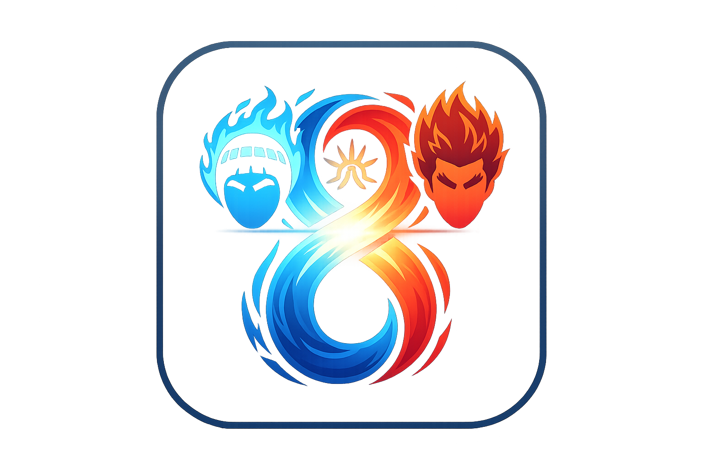

<p align="center">
  
</p>

<p align="center">
  
  
  
  
  
</p>

<h1 align="center">Hachimon</h1>

<p align="center">
  <strong>八門遁甲 — 기억의 문을 하나씩 여는 간격 반복 시스템</strong><br/>
  Obsidian Vault의 플래시카드를 SM-2 알고리즘으로 복습하는 서버리스 모바일 PWA
</p>

---

## What is Hachimon?

Hachimon은 백엔드 없이 돌아가는 정적 PWA입니다. Obsidian 노트를 Kotlin CLI로 파싱해서 `cards.json`을 만들고, Cloudflare Pages에 올립니다. 복습 스케줄링은 브라우저 IndexedDB에서 처리하기 때문에 별도 서버가 필요 없습니다.

```
Obsidian Vault (.md)
  → Kotlin CLI 파서 → cards.json (정적)
  → git push → Cloudflare Pages
  → React PWA → fetch → IndexedDB (로컬)
```

### Why Hachimon?

| 기존 SRS | Hachimon |
|:--------:|:--------:|
| 서버 필요 | 완전 서버리스 (정적 호스팅) |
| 앱 설치 필요 | PWA — 브라우저에서 바로 사용 |
| 범용 카드 | 개발자 면접 특화 (코드 하이라이팅) |
| 단일 난이도 | 3-Tier (Foundation → Mechanism → Diagnosis) |
| 수동 카드 생성 | Obsidian Vault에서 자동 파싱 |
| 단일 복습 모드 | 오늘의 복습 + 단련 + 새 카드 학습 |

---

## Architecture

```
┌──────────────────────────┐
│    Obsidian Vault        │
│    (Markdown files)      │
└────────────┬─────────────┘
             │
    ┌────────▼────────┐
    │  Kotlin CLI     │
    │  (GraalVM)      │
    │  파싱 + 분류     │
    └────────┬────────┘
             │
    ┌────────▼────────┐
    │  cards.json     │
    │  (정적 데이터)    │
    └────────┬────────┘
             │ git push
    ┌────────▼────────┐
    │ Cloudflare Pages│
    │  (정적 호스팅)    │
    └────────┬────────┘
             │ fetch
    ┌────────▼────────────────────────┐
    │        React PWA               │
    │  ┌───────────┐  ┌───────────┐  │
    │  │  SM-2     │  │ IndexedDB │  │
    │  │ Algorithm │  │  (로컬)    │  │
    │  └───────────┘  └───────────┘  │
    │  ┌───────────────────────────┐ │
    │  │  4탭 + 3 플로우 화면       │ │
    │  │  홈 | 덱 | 통계 | 설정    │ │
    │  └───────────────────────────┘ │
    └────────────────────────────────┘
```

---

## Key Features

### 3가지 복습 모드

- **오늘의 복습** — SM-2 due 카드 15장 자동 선택. overdue 우선, 원탭 시작.
- **단련(鍛鍊)** — 덱 트리 + 티어 필터 + 세션 크기 조절. 약점을 거듭 벼리는 맞춤 훈련.
- **새 카드 학습** — Foundation → Mechanism → Diagnosis 순차 노출.

### 3-Tier 난이도 체계

| Tier | 색상 | 의미 | 예시 |
|------|------|------|------|
| Foundation | Blue (#60a5fa) | 개념 확인 — 정의, 용어 | "트랜잭션 격리 수준의 종류는?" |
| Mechanism | Amber (#fbbf24) | 동작 원리 — 내부 구현, 비교 | "REQUIRES_NEW와 NESTED의 차이점은?" |
| Diagnosis | Red (#f87171) | 실전 진단 — 트러블슈팅, 설계 판단 | "N+1 문제가 발생했을 때 해결 전략은?" |

### SM-2 간격 반복 알고리즘

```
quality 매핑: Again(0) → Hard(2) → Good(4) → Easy(5)

quality < 3  → repetitions 리셋, interval = 1일
quality >= 3 → rep 0이면 1일, rep 1이면 6일, 이후 interval × EF

Ease Factor: 초기 2.5, 최소 1.3
```

### Eight Gate 컬러 시스템

팔문둔갑의 8개 문에서 따온 컬러 팔레트. 티어 뱃지, 덱 인디케이터, 차트 등 UI 전반에 사용됩니다.

```
Gate 1 (Opening)  → #60a5fa  Blue
Gate 2 (Healing)  → #38bdf8  Cyan
Gate 3 (Life)     → #34d399  Green
Gate 4 (Pain)     → #a3e635  Lime
Gate 5 (Limit)    → #fbbf24  Amber
Gate 6 (View)     → #fb923c  Orange
Gate 7 (Wonder)   → #f87171  Red
Gate 8 (Death)    → #e11d48  Crimson
```

### IndexedDB 로컬 스토리지

학습 데이터를 브라우저에 저장합니다. 서버 통신 없이 오프라인에서도 동작합니다.

| Store | 내용 |
|-------|------|
| `cards` | 카드 메타데이터 (id, deck, tier, question, answer) |
| `schedules` | SM-2 상태 (easeFactor, interval, nextReviewAt) |
| `reviewLog` | 복습 기록 (quality, reviewedAt, sessionId) |
| `settings` | 사용자 설정 (JSON) |

### 머지 로직 (cards.json → IndexedDB)

| 상태 | 동작 |
|------|------|
| 서버에 있고 로컬에 없음 | 새 카드로 추가, SM-2 초기 상태 |
| 로컬에 있고 서버에 없음 | 삭제 (스케줄 포함) |
| 같은 ID, sourceHash 다름 | Q/A만 갱신, SM-2 스케줄 유지 |
| 같은 ID, sourceHash 동일 | 무시 |

---

## 화면 구성

### 4탭

| 탭 | 내용 |
|----|------|
| 홈 | 3칸 요약 (복습/연속일수/전체), 오늘의 목표 진행률, 복습·단련 버튼, 복습 대기 Top 3, 약한 카드 |
| 덱 | 6개 그룹 덱 트리 (접기/펼치기), 탭 → 덱 상세 바텀시트 (티어 뱃지 + 카드 미리보기) |
| 통계 | 총 복습/마스터/정답률, 20주 복습 히트맵, 30일 바 차트 (3색 그라데이션), 티어별 정답률 |
| 설정 | 세션 설정 슬라이더 3종, SM-2 파라미터, 프리셋 4종, 데이터 관리 (내보내기/초기화) |

### 3 플로우 화면

| 화면 | 진입 | 내용 |
|------|------|------|
| Forge | 홈 → "단련" | 덱 선택(다중) + 티어 칩 + 세션 크기 + 시작 |
| ReviewSession | 홈 → "오늘의 복습 시작" 또는 Forge | 프로그레스 바 + 질문→답변 + 4단계 평가 |
| SessionComplete | ReviewSession 완료 | 정답률, 소요시간, 티어별 결과, 재복습/홈 |

---

## 내 Obsidian 연동하기

개별 사용자는 **앱 안에서 직접** 본인 Obsidian Vault를 가져올 수 있습니다 (CLI·배포 불필요). 앱이 `.md`를 브라우저에서 파싱해 IndexedDB에 저장하며, 노트는 어디로도 업로드되지 않습니다.

> 설정 탭 → **데이터 소스 → Obsidian Vault 가져오기**

자세한 노트 작성 포맷·설치·갱신 방법은 **[Obsidian 연동 가이드](docs/obsidian-guide.md)** 를 참고하세요. 인앱 파서 구현은 `src/lib/obsidian.ts` (유닛 테스트: `src/lib/obsidian.test.ts`).

---

## CLI Parser (빌드타임 파이프라인)

> maintainer가 자신의 Obsidian 볼트를 빌드 타임에 `cards.json`으로 굽고 싶을 때를 위한 옵션입니다. 개별 사용자는 위의 **인앱 가져오기**로 충분합니다.

Node/TS CLI로 볼트 디렉토리를 재귀 파싱하여 `cards.json`을 생성합니다.

```bash
$ npm run parse -- /path/to/vault -o public/cards.json
# ✓ N decks / M cards → public/cards.json
```

배포 흐름: `parse` → `git commit public/cards.json` → push → Cloudflare Pages. 배포된 앱이 샘플이 아닌 실제 카드를 싣게 됩니다.

이 CLI는 인앱 가져오기와 **동일한 파서**(`src/lib/obsidian.ts`의 `parseVault`)를 재사용합니다. 빌드타임 경로(CLI)와 런타임 경로(인앱)가 같은 id·sourceHash·덱 집계를 내므로 결과가 일관됩니다. 구현: `scripts/parse-vault.ts` (유닛 테스트: `scripts/parse-vault.test.ts`).

### 파싱 규칙

1. `## Self-Test Anchors` 이하만 스캔
2. `#flashcard/...` 패턴으로 덱 경로 추출
3. `### Foundation` / `### Mechanism` / `### Diagnosis`로 티어 매핑
4. `질문?::답변` 형식으로 Q/A 분리 (답변은 다음 카드/티어/헤딩 전까지 **여러 줄** 가능)
5. 답변 내 마크다운 (멀티라인 코드블록, 볼드, 인라인코드) 보존 — 펜스/인라인코드 안의 `::`는 카드 경계로 오인 안 함

---

## 인박스 파이프라인 (Forge)

Obsidian 인박스에 막 던져둔 raw 캡처(`.md`)를 Claude로 **정리된 노트 + 덱 분류 + 3-tier 퀴즈 카드**가 담긴 draft로 변환하는 Node/TS CLI입니다. 결과 draft는 사람이 Obsidian에서 검토·승격한 뒤 빌드타임 파서로 `cards.json`에 합쳐집니다.

```bash
$ npm run inbox -- <inbox-dir> [--dry-run]
# ✓ N개 처리 / M개 draft 생성 / K개 보류
```

`ANTHROPIC_API_KEY` 환경변수가 필요합니다(Claude 호출).

### 옵션

| 옵션 | 기본값 | 설명 |
|------|--------|------|
| `<inbox-dir>` | (필수) | raw `.md` 캡처가 담긴 인박스 디렉토리 |
| `-o` / `--out` | `_forge-drafts` | draft 출력 디렉토리 |
| `--deck-source` | `public/cards.json` | 기존 덱 목록 소스(`.json`이면 cards.json 파싱, 아니면 vault 디렉토리로 간주) |
| `--model` | `claude-opus-4-8` | 사용할 Claude 모델 |
| `--dry-run` | off | 파일을 쓰지 않고 조립된 draft를 콘솔에 출력(인박스 원본 보존) |
| `--keep` | off | draft를 쓰되 인박스 원본을 삭제하지 않음 |

### 흐름

```
인박스 raw .md
  → Claude 2회 호출 (① 노트 정리·덱 분류 / ② 3-tier 퀴즈 생성)
  → 노트 조립 → parseVault 라운드트립 검증(카드 개수·질문·답변 일치) 통과 시에만
  → _forge-drafts/<deck>/<slug>.md
  → 사용자가 Obsidian에서 검토·승격(이동)
  → npm run parse 로 cards.json 빌드
```

덱은 노트 안의 `#flashcard/<deck>` **태그로 결정**되므로, draft를 vault 어디로 옮겨도 분류가 보존됩니다(이동 위치 무관). 조립 결과는 앱·CLI·플러그인과 **동일한 단일 진실원천 파서**(`parseVault`)로 라운드트립해 의도한 카드가 그대로 추출되는지 검증한 뒤에만 draft로 기록하며, 검증에 실패한 노트는 보류하고 인박스 원본을 보존합니다. 구현: `scripts/inbox.ts`(부수효과·Claude 호출), 순수 로직은 `src/lib/forge/*`(schema·prompts·decks·assemble).

> ⚠️ 빌드타임 파서(`npm run parse`)는 `_forge-drafts`와 `inbox` 디렉토리를 vault 스캔에서 제외합니다(미검수 draft·raw 캡처가 `cards.json`에 섞이지 않도록). `-o`로 **다른 이름의 출력 폴더**를 쓰거나 인박스를 다른 이름으로 두고 그 폴더가 **vault 내부에 있다면**, `scripts/parse-vault.ts`의 `EXCLUDE_DIRS`에 그 이름을 직접 추가하세요.

---

## Project Structure

```
hachimon/
├── src/
│   ├── components/
│   │   ├── ui/                 # shadcn/ui (Button, Card, Badge, Separator)
│   │   ├── layout/             # TabBar, PageLayout
│   │   └── shared/             # SectionLabel, StatRow, ProgressBar, TierBadge
│   ├── pages/
│   │   ├── Home.tsx            # 대시보드 + 액션 버튼
│   │   ├── Decks.tsx           # 덱 트리 + 바텀시트
│   │   ├── Stats.tsx           # 히트맵 + 차트 + 정답률
│   │   ├── Settings.tsx        # 슬라이더 + 프리셋 + 데이터 관리
│   │   ├── ReviewSession.tsx   # 복습 세션
│   │   ├── Forge.tsx           # 단련 설정
│   │   └── SessionComplete.tsx # 세션 결과
│   ├── lib/
│   │   ├── sm2.ts              # SM-2 알고리즘
│   │   ├── db.ts               # IndexedDB (idb) 래퍼
│   │   └── merge.ts            # cards.json ↔ IndexedDB 머지
│   ├── types/
│   │   └── index.ts            # Card, Deck, Schedule, ReviewLog
│   ├── App.tsx                 # 4탭 + 3플로우 라우팅
│   ├── main.tsx
│   └── index.css               # Tailwind + 다크테마 + 애니메이션
├── public/
│   ├── cards.json              # CLI 파서 출력물 (정적)
│   ├── logo.png                # 앱 아이콘
│   └── favicon.ico
├── CLAUDE.md                   # 프로젝트 스펙 문서
├── index.html
├── vite.config.ts
├── tsconfig.json
└── package.json
```

---

## Design System

### 테마

항상 다크 테마. zinc 팔레트 기반 + Eight Gate 액센트 컬러.

| 요소 | 값 |
|------|-----|
| 배경 | zinc-950 (#09090b) |
| 카드 배경 | zinc-900 (#18181b) |
| 보더 | zinc-800 (#27272a) |
| 1차 텍스트 | zinc-50 (#fafafa) |
| 2차 텍스트 | zinc-400 (#a1a1aa) |
| 프라이머리 | blue-600 (#2563eb) |

### 폰트

| 용도 | 폰트 | 이유 |
|------|------|------|
| 한글 본문 | Noto Sans KR | 작은 크기에서도 선명, 장시간 읽기에 적합 |
| 영문/숫자 | DM Sans | 숫자 폭 고정(tabular), 0/O·1/l 혼동 없음 |

### 애니메이션

| 이름 | 용도 |
|------|------|
| `animate-up` + `stagger-1~5` | 페이지 진입 시 순차 등장 |
| `animate-tab-in` | 탭 전환 fade |
| `animate-expand` | 덱 트리 펼치기 |
| `animate-sheet` + `animate-overlay` | 바텀시트 슬라이드 + 오버레이 fade |

---

## 설정 기본값

| 항목 | 기본값 | 범위 |
|------|--------|------|
| 일일 신규 카드 | 10장 | 0~30 |
| 일일 복습 상한 | 50장 | 10~200 |
| 세션당 카드 수 | 15장 | 5~30 |
| SM-2 초기 EF | 2.5 | 1.3~3.0 |
| SM-2 최소 EF | 1.3 | 1.0~2.0 |

---

## Tech Stack

| Layer | Technology | Why |
|-------|-----------|-----|
| CLI 파서 | Kotlin + GraalVM | Obsidian Vault 파싱, 네이티브 바이너리 |
| 프레임워크 | React 18 + TypeScript | Strict mode, 컴포넌트 기반 |
| 스타일링 | Tailwind CSS 4 + shadcn/ui | 유틸리티 기반, 디자인 시스템 |
| 빌드 | Vite 8 | 빠른 HMR, 최적화 빌드 |
| 로컬 저장소 | IndexedDB (idb) | 브라우저 내 데이터 영속화, 서버 불필요 |
| 호스팅 | Cloudflare Pages | 정적 호스팅, 글로벌 CDN |
| 오프라인 | vite-plugin-pwa (Workbox) | Service Worker 오프라인 캐싱 |
| 아이콘 | lucide-react | 트리 쉐이킹 가능한 SVG 아이콘 |

---

## Roadmap

```
v0.1 (MVP)
  └ CLI → cards.json → PWA 복습 세션 → Cloudflare 배포

v0.2
  ├ 단련 모드
  ├ Home/세션완료 화면
  ├ 마크다운 렌더링
  └ 코드 하이라이팅

v0.3
  ├ 오프라인 (Service Worker)
  ├ 새 카드 학습
  ├ 스와이프 제스처
  ├ 설정
  └ A2HS (홈 화면 추가)

v0.4
  ├ 덱 탭 + 통계 탭
  └ Web Push 리마인더

v0.5
  ├ FSRS 전환 검토
  ├ Obsidian 플러그인
  └ 이미지 카드
```

---

## Branding

- **이름**: Hachimon (八門, 팔문)
- **컨셉**: 나루토의 팔문둔갑술 — 복습할수록 기억의 문이 하나씩 열린다
- **색상**: 1문(Blue) → 8문(Crimson) 그라데이션 진행
- **도메인**: hachimon.app

---

## License

Private

---

<p align="center">
  <sub>Built with Claude Code</sub>
</p>
